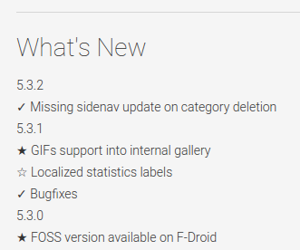

PSMetadataFetcher
========================

PHP and Javascript scripts useful to retrieve apps metadata (size, version...) from Google Play Store.

Google doesn't provide an API access to easilly retrieve Android application's useful data like for example the actually released version to compare with the one installed on a device and eventually prompt for updates.

A common method to accomplish this task is by providing a service or a web page where to store the app necessary  data and then retrieve them directly from the device when needed.
But given that Google already provides a portal, as I am lazy, I'd like to try to take advantage of their web infrastructure.

## Usage

1. Upload the project on a hosting managed by Apache

2. Perform a HTTP GET request to ``` get_app_data.php?url= ``` using as url query parameter the url of app into Google Play Store, like:

   ```http
   [YOUR_HOST]/get_app_data.php?url=https://play.google.com/store/apps/details?id=it.feio.android.omninotes
   ```

3. A json similar to the following will be returned, the language will depend on your locale:

   ```json
   {
     "datePublished": "18 gennaio 2014", 
     "fileSize": "1,8M", 
     "numDownloads": "500-1.000", 
     "softwareVersion": "4.1.2", 
     "operatingSystems": "2.3 e superiori", 
     "contentRating": "Maturità bassa"
   }
   ```

### Caching

To reduce data overload the following method is used:

1. *page_mirror.php* script has the goal of retrieving a complete local replica of the webpage passed as URL parameter;
2. Once downloaded the data content will be stripped off of  and <src> tags as much as possible, but this procedure, due to limitation of used host, is accomplished with regex, not the best (of course) way to do HTML parsing, but it's quietly acceptable for our purpose;
3. A time based check is made to avoid to many useless calls from host to Play Store site and results are stored in a cache text file. 
4. *get_app_data.php*, the script that receives the calls from client, will perform an inter-script data transfert to get the minimum possible portion from *page_mirror.php* selecting tags with *simple_html_dom.php* (PHP library that allows JQuery-like DOM elements selectors) and will build a JSON object string to send back to client.
   If possible this step is made by retrieving data from the cache file.

### Multiple versions on Play Store

If multiple versions of the app have been released on the Play Store the ``` softwareVersion ``` field could contain just something like "Varies with device".
The workaround used to manage this situation is to create the changelog like the one that follows, by putting the latest released version on top of it.

 

By doing like this the script will automatically parse the version and replace into the returned JSON.